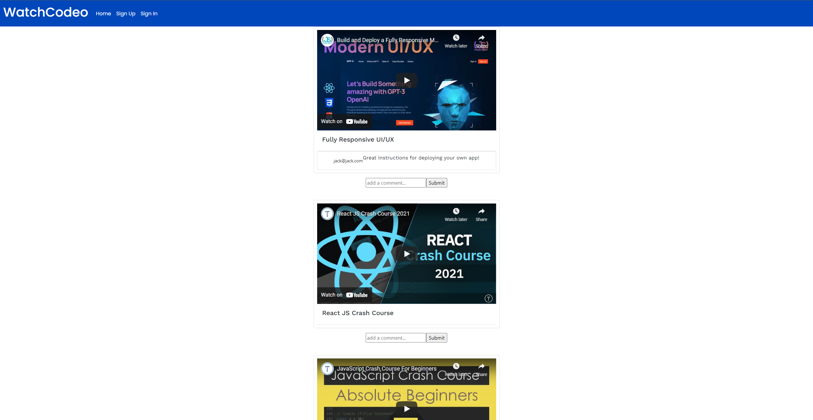

## WATCH CODEO

## DEPLOYED LINK

https://watchcodeo.herokuapp.com/

## SERVER REPO:
https://github.com/dryutsun/bingbong-videoapp-server

## TECHNOLOGIES USED:

### PRIMARY STACK:

MongoDB: We used MongoDB because the flexibility of Mongo schemas allowed us to iterate through our implementation much quicker and with less punishment. Additionally, we initally believed it would help us seed faster. We utilized Mongoose as an ODM, which allowed us to interface without our mongoose database much in the same way that we would in a conventional relational database.

Express:  We used express because of its clean routing. We have experience in Express given project 2. It had a robust library and many middleware programs that we could utilize to improve the functionality of our program. 

React: We utilized react because of the smooth nature of SPA. As opposed to loading and refreshing a page, we would only be leoading the information that is required for the particular components that we need. This gave us the ability to make asynchronous requests.

NodeJS: We used Node because of its robust library and built in features. Node allowed us to "see" the payloads that Mongoose would pass to MongoDB to write/read.

## APPROACH

We believed the best approach was to build the backend first and move to the frontend. We went through many iterations and consulted with the TA’s to determine if what we were attempting was a good path forward. 

This "backend first" approach, we still believe to be the best approach, however we ran into many problems having to do with the "type" of information that we were receiving from props or the database. We realized the importance of type strictness. 

Many of the other problems we ran into may have had to do with how tightly coupled the relationships were, especially for display. We see the difficulty in making a social website.

We started with task delegation but this turned out not to be the best approach. Instead, we did “pair” programming with the whole team -- this allowed us to contribute equally and focus on the most prescient tasks. However, this came at the cost of being able to work on multiple features at once. Everyday we did a standup meeting for the daily tasks that we were going to approach and then at the end of the day, we did a review of our tasks and planned for the next day according to our sprint schedule.

We underestimated the difficulty of the challenges we would encounter in React. Many of our intial MVP estimates, had to be changed to stretch goals as we struggled to implement our features in a React Like Way. 

As for our Development Pipeline approach, we did fairly well with regular commits, orderly merges, up until the last few days, when the git manager forgot what branch he was in. 

## INSTALLATION INSTRUCTIONS
# FOR Client
- Clone client repository on Github: https://github.com/jmeier2715/bingbong-client
- Install all dependencies using `npm i`
- Clone server repository on Github: https://github.com/dryutsun/bingbong-videoapp-server
- Go inside `bingbong-videoapp-server` directory and run `node server.js`
- In another terminal, navigate into bingbong-client folderand run `npm start`.
- If installation was successful, you should see the app running on localhost.

## USER STORIES REVIEW

### USER INTERACTION WITH GLOBAL CONTENT:

- As a user, I want to be able to log in securely to my own account.

- As a user, once I log-in I want to be presented with a random feed of videos to browse. 

- As a user, I would also like to interact with a particular video and leave a comment or a “helpful” rating on a video. 

- As a user, I want to be able to view my own videos and anyone else’s videos.

- As a user, I would like to edit the description information, but I want to be prevented from changing the link, as that forms the “identity” of the content I am sharing. 
    - This latter goal was achieved, while the former was not.

- As a user, only I can delete my own video or remove its reference. I expect the entire “content” to be removed as a result.

## STRETCH GOALS

- Moved to Stretch Goal: By other user’s interactions, I mean I’d like to see if users have rated the video as “helpful”.

- Moved to Stretch Goal: By relevant, I mean the highest rated/most helpful videos that other users have either commented on or marked as helpful. 

- Move to Stretch Goal: As a user, I’d like to select a particular video to ‘focus’ on and be brought to a page where other user’s interactions are visible. 

- Stretch Goal: As a User, it would be nice to be able to filter by the most relevant. 

- Moved to Stretch Goal: As a user, I would also like to filter videos by title, or perhaps a tag (topic?). I want to be able to find content specific to my learning needs and interests. 
    - Categories implemented, but not used...

USER INTERACTION WITH PERSONAL CONTENT:

As a user, I’d like to add a video link along with other informative details, such as the content creator, the topic, the programming language, or any other relevant information that is relevant to a video’s “educational” value.

As a user, I want to be able to view my own videos and anyone else’s videos.

## LINK TO WIREFRAMES & ROUTES

| VERB  | ROUTE   | ACTION   | DESCRIPTION   |
|---|---|---|---|
|GET:|/videos/|Index(Read)|Displays a list of all videos|
|GET:|/videos/:videosId|Show(Read)|Displays a specific video|
|POST:|/videos/:videoId|Create(Create)|Creates and posts a payload to Video in DB|
|PATCH:|/videos/:videoId|Edit(Update)|Finds a video in the DB, updates title and category from payload and updates DB   |
|DELETE:|/videos/:videoId|   |   |

## COMMENT:
| VERB  | ROUTE   | ACTION   | DESCRIPTION  |
|---|---|---|---|
|GET:| /comments | Index (Read)   | Unused after Schema change  |
|GET:| /comments/:videoId/:commentId  | Show  | Displays a specific comment for a specific video  |
|POST:| /comments/:videoId/ | Create   | Post a comment to a specific video  |
|PATCH:| /comments/:videoId/:commentId  | Update   | Update a specific comment for a specific video (unimplemented)   |
|DELETE:| /comments/:videoId/:commentId  | Delete/Destroy  | Remove a comment  |

## PROFILE:
| VERB  | ROUTE   | ACTION   | DESCRIPTION  |
|---|---|---|---|
|GET:|/users  | Index  |  Retrieves all profiles in the database |
|GET:|/users/:id  | Show  | Show’s a users profile page |
|POST:| /users  | Create  |  Create a username for your profile |

## UNSOLVED PROBLEMS

- Our team struggled to get the live-update functions working. I believe we still do not have a complete grasp on state management and refreshing props. At the moment, there are some features that in terms of UI have a “refresh”, but with other components like the main feed we cannot get to refresh automatically.

- Mongo Schema’s and association misunderstanding between references vs subdocuments and the best way and scenarios in which they should be used. Additionally, we struggled with certain document “objects” not giving us access to their _id’s. In the end, this caused many difficulties.
	- Our delete comment function does not work because we could not access ids. We changed the schema because of this. PostedBy, in a former schema iteration would not accept the JSON payload for the _id that we passed to it, saying it was undefined. Enough time was spent on it, to determine that it was not just us. Had we had more time, we would have passed a UUID value and targeted our comments this way. 

- We struggled with the best way to “get what we need” from props. Oftentimes, it involved a lot of manipulation to get the exact thing that we wanted. It seemed a little inefficient. We wondered about better ways to get state. Should certain fetch calls be super specific to get exactly what we want?

- We struggled, given the many dependencies of our props -- to make the available globally. We did some research but it would take too much refactoring to achieve what we had done already. 